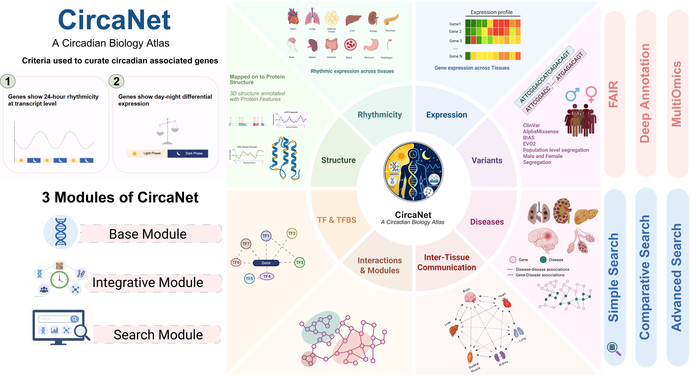

# CircaNet – A Circadian Biology Atlas

[](https://creativecommons.org/licenses/by/4.0/)
[](https://www.imtech.res.in/)
[](https://datascience.imtech.res.in/anshu/circanet/)
---

[](IMAGE/graphical_abstract.png)

**CircaNet** is currently hosted at [CircaNet - A Circadian Biology Atlas](https://datascience.imtech.res.in/anshu/circanet/)

---

CircaNet is an integrated, curated, and value-added knowledge-base for human circadian biology. CircaNet is a dedicated multi-omics circadian resource developed to provide deep insights into clock-controlled mechanisms and expand our understanding of circadian disruption in human health and disease.

CircaNet unifies circadian gene profiles, AlphaFold structural annotations, residue-level biophysical features, variant pathogenicity metrics, regulatory networks, inter-tissue communication axes, tissue-specific rhythmicity, and clinical comorbidity landscapes. This centralized platform assists researchers in dissecting chronobiological pathways and accelerating targeted chronomedicine and biomarker discovery.

---

## Modules of CircaNet

1. **Base Module**:
   * Gene Catalog
   * Gene Profiles
   * Orthologs

2. **Integrative Modules**: The integrative module provides multidimensional biological layers across circadian genes:
   * **Structure & Protein Features**:
     * AlphaFold 3D Structural Models & pLDDT Confidence Scores
     * Post-Translational Modifications (PTMs)
     * Intrinsically Disordered Regions (IDRs)
     * Liquid-Liquid Phase Separation (LLPS) Propensity Scores
   * **Variants & Pathogenicity**:
     * AlphaMissense Pathogenicity Scores (Residue & Gene Level)
     * ClinVar Clinical Variant Records
     * Population Allele Frequencies
   * **Networks & Interactions**:
     * Protein-Protein Interactions (PPI) & Functional Community Modules
     * Transcription Factors & Binding Sites (TF & TFBS)
     * Inter-Tissue Communication & Global Centrality Networks
   * **Rhythmicity & Expression**:
     * Tissue-Specific Expression Profiles (GTEx) & Tissue Specificity Index (TSI)
     * Parametric Circadian Oscillation Metrics (Phase, Amplitude, Periodicity)
   * **Disease & Comorbidity**:
     * Gene-Disease Phenotypic Associations
     * Circadian Comorbidity Mapping

3. **Visualization & Search Modules**: Interactive network, structure, and genomic feature visualizations:
   * Interactive Network Visualizer (PPI & Inter-Tissue Dynamics)
   * Gene & Variant Search Tools
   * Advanced Multi-Query Filters

4. **Accessory Modules**:
   * Data Summary & Statistics
   * Data Downloads (Tabular datasets, GFF files, Network edge-lists)
   * FAQs, Tutorials & Help Documentation

---

## Database Architecture

The backend was built using the LAMP stack with PostgreSQL, which includes Linux (operating system), Apache (web server), MySQL (database), and PHP (server-side scripting). The web interface is created with HTML, CSS, JavaScript, and interactive visualization libraries. CircaNet runs on a secure Linux server where Apache handles incoming requests, PHP scripts manage data processing and API logic, and MySQL manages the structured biological data.

---

## Repository Structure

This repository is organized into two main directories: `CircaNet source code/` which contains the source for the Database, and `CircaNet Analysis/` which contains the data generation and analysis pipelines for each module.

Below is a visual representation of the repository's layout:

```text
.
├── CircaNet source code/
│   └── (All scripts and files for the CircaNet Database)
│
└── CircaNet Analysis/
    ├── Base_Module/
    │   ├── Scripts/
    │   └── Readme.md
    │
    ├── Structure_and_Features/
    │   ├── Scripts/
    │   └── Readme.md
    │
    ├── Variants_and_Pathogenicity/
    │   ├── Scripts/
    │   └── Readme.md
    │
    ├── Networks/
    │   ├── Scripts/
    │   └── Readme.md
    │
    ├── Expression_and_Rhythmicity/
    │   ├── Scripts/
    │   └── Readme.md
    │
    └── Disease_Comorbidity/
        ├── Scripts/
        └── Readme.md
